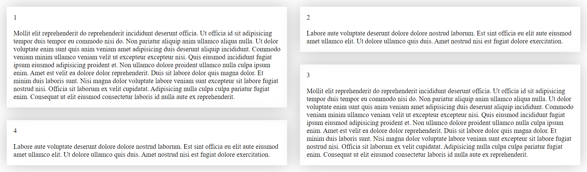

# react-smart-masonry

This package is perfect for situations where the standard behavior of the `flex` css property is not suitable. If you need to arrange elements in order in several columns, and the placed elements have different heights, the `Masonry` component which imports from this package will fit them on the page with the ability to determine the optimal position for each element.


## Installation

```bash
npm i react-smart-masonry
```

or using **Yarn**:

```bash
yarn add react-smart-masonry
```

## Unique properties

| Name        |            Type            | Default | Description                                                                                                                                                                                                                                                                             |
| ----------- | :------------------------: | :-----: | --------------------------------------------------------------------------------------------------------------------------------------------------------------------------------------------------------------------------------------------------------------------------------------- |
| breakpoints |           object           |         | Breakpoints for adaptive component tuning, where key is the name of the breakpoint, value is the number of pixels of minimum width (numeric value). Breakpoints work like `@media (min-width: ...)`.                                                                                    |
| columns     |      number \| object      |    1    | The number of columns. If no value is specified or not found (in the case of breakpoints), items will be lined up in a single column.                                                                                                                                                   |
| gap         | string \| number \| object |    0    | Indent between elements. It can take both a numeric and a string value available for the css property `padding`. If value is not specified or not found (in the case of breakpoints), items will be indented zero.                                                                      |
| reverse     |          boolean           |  false  | Arranges items in reverse order. It is useful if you need to display elements added to the end of an array, at the top.                                                                                                                                                                 |
| autoArrange |          boolean           |  false  | Includes smart arrange of elements. In this case, the elements will not be placed strictly in order in each column, instead, the component will take into account the element's height and position the element in the correct column to create an optimal layout (see «Auto arrange»). |

> Since the `Masonry` component is a `div` element, you can also pass any property available to the `div` element.

## Using

The package exports the default `Masonry` component. The `Masonry` component is a wrapper over the elements that needs to be positioned. All you need is to set the necessary parameters for the `Masonry` component, after that the magic will start to work,

like this:

```jsx
import React from 'react';
import Masonry from 'react-smart-masonry';
import articles from './articles'; // sample dataset

export default function Example() {
  return (
    <Masonry columns={5} gap={20}>
      {articles.map((item) => (
        <div key={item.id}>{item.text}</div>
      ))}
    </Masonry>
  );
}
```

In this example, we have created five columns with 20px spacing between items.

> The value of the `gap` property is the value for the css property of `padding`, so you can pass not only a numeric value, but also a string value comparable to the `padding` property, for example: `gap="2rem"`. If a numeric value is passed, the default unit will be `px`.

If we do not pass any values for these properties, the elements will be lined up in one column, and the indentation will be zero.

## Breakpoints

The `Masonry` component is responsive to the width of the browser window, so you can control the number of columns or the amount of padding between elements for different screen sizes. This behavior is easily customizable by passing the `breakpoints` property to the `Masonry` component. In this case, the `columns` and `gap` properties (if you want to make them responsive) should be passed as objects with keys equal to the keys of the `breakpoints` object.

Breakpoints will act like: `@media (min-width: ...)`.

For example:

```jsx
import React from 'react';
import Masonry from 'react-smart-masonry';
import articles from './articles'; // sample dataset

const breakpoints = { mobile: 0, tablet: 900, desktop: 1600 };

export default function Example() {
  return (
    <Masonry
      breakpoints={breakpoints}
      columns={{ mobile: 2, tablet: 3, desktop: 4 }}
      gap={{ mobile: 20, tablet: 30, desktop: 40 }}
    >
      {articles.map((item) => (
        <div key={item.id}>{item.text}</div>
      ))}
    </Masonry>
  );
}
```

In this example, when the browser window width is from 0px to 900px (excluding 900px), the elements will be lined up in two columns with a 20px padding between the elements, from 900px to 1600px (excluding 1600px) - three columns with a 30px padding and from 1600px and above the values for the "desktop" breakpoint will be saved.

You can give breakpoints absolutely any name, which is especially useful if you already have breakpoints, then you can simply import your breakpoints and pass them to the component, while the order and number of breakpoints is absolutely not important, the component will automatically find the desired breakpoint.

You don't even need to include all the values for all breakpoints that are in the `breakpoints` object, for example, if you want the indentation to remain unchanged when the window is 900px wide (for example,"tablet"), just pass two values: `gap={{ mobile: 20, tablet: 30 }}`.

> If you set a minimum breakpoint more than 0px, for example, 300px, then when the browser window is between 0px and 300px wide (not including 300px), the `columns` and `gap` properties will take on their default values.

## Auto arrange

By default, the smart arrange of elements is disabled, which means that elements will be placed strictly in turn in each column, regardless of their height. In most cases this will not cause any problems, however, sometimes it can create a situation where one column is much taller than the others. To prevent such a situation, you can use the additional property `autoArrange`. With the `autoArrange` property enabled, the component will automatically define a column for each element, taking into account the height of the element itself, to create an optimal layout.

Let's look at a simple example with the **disabled** `autoArrange`:


As you can see from the numbering, the elements are arranged strictly in turn from left to right, while the left column is twice the size of the right one.

Let's now look at the same example, but this time with the **enabled** `autoArrange`:



The size of the elements remains the same, however, we can see how the elements are lined up out of sequence, creating the most optimal layout.

> This behavior is not always necessary, and it leads to additional recalculation of elements, so this option is disabled by default.

## Feedback

If you find a bug or want to make a suggestion for improving the package, [open the issues on GitHub](https://github.com/GoncharukBro/react-smart-masonry/issues) or email [goncharuk.bro@gmail.com](mailto:goncharuk.bro@gmail.com).

Support the project with a star on [GitHub](https://github.com/GoncharukBro/react-smart-masonry) ⭐.

## License

MIT © [Nikolay Goncharuk](https://github.com/GoncharukBro)
